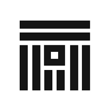

# Practica_UNITBV
## Descriere-tutorial python
Python este un limbaj de programare dinamic multi-paradigmă, creat în 1989 de programatorul olandez Guido van Rossum. Van Rossum este și în ziua de astăzi un lider al comunității de dezvoltatori de software care lucrează la perfecționarea limbajul Python și implementarea de bază a acestuia, CPython, scrisă în C. 

[Link catre pyhton](learnphyton.org) 

